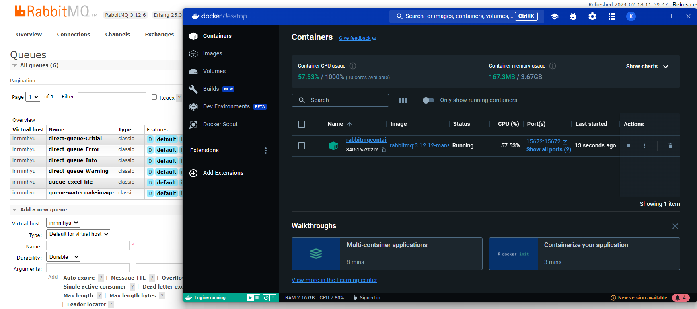
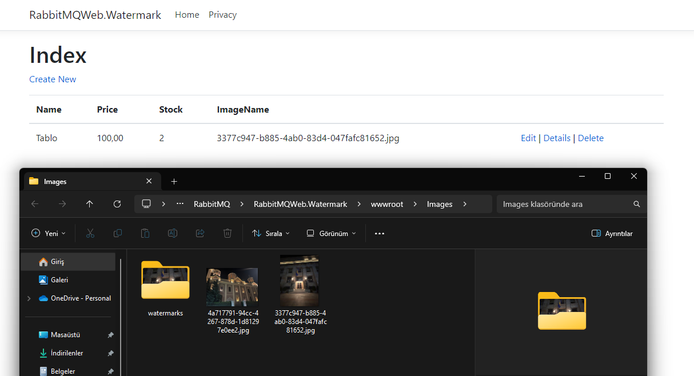
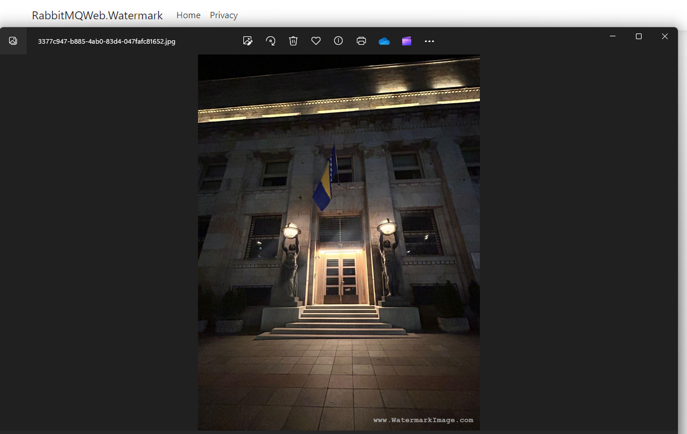
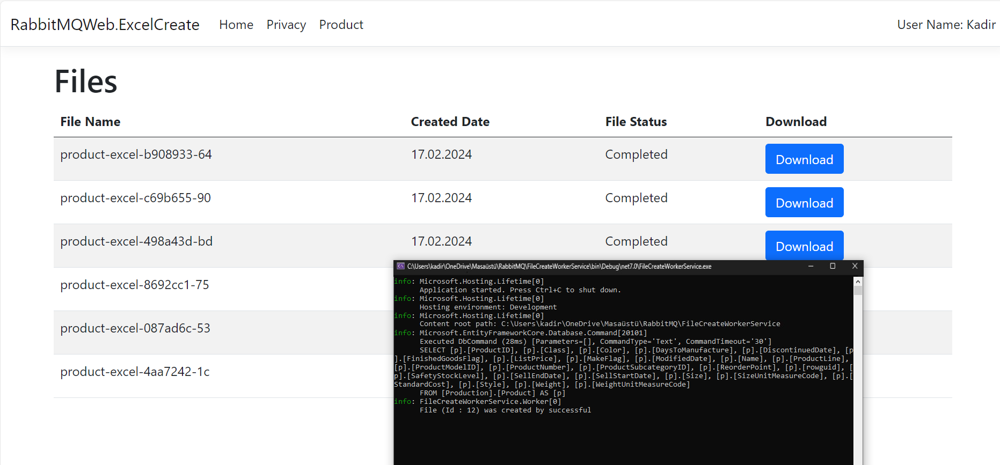
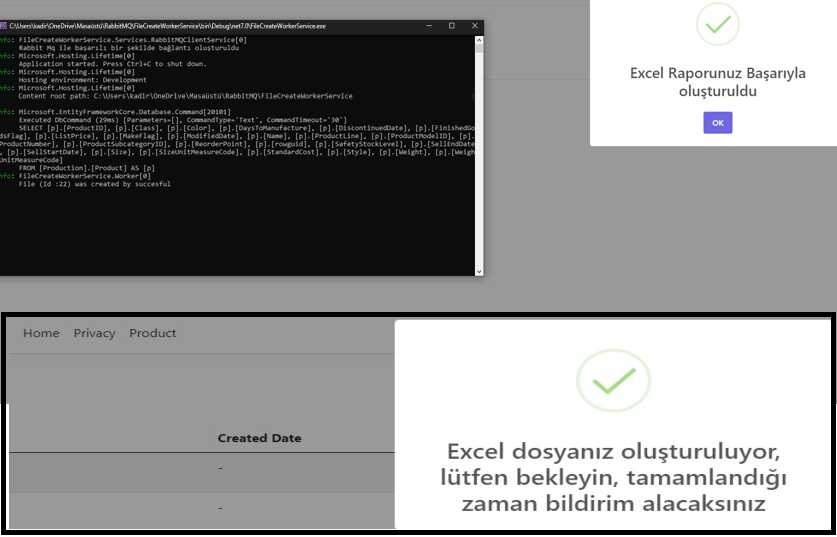

# RabbitMQ

> I have implemented different exchange types of RabbitMQ (Direct, Fanout, Topic and Headers) in my project and created examples of how these types are used.
----

>Throughout the process, I managed my project with RabbitMQ Cloud and Docker.

----

#### WaterMark

>I used RabbitMQ to add watermark to images. For this process I created a producer producer, consumer and a web API project. The images are transmitted through the web API, RabbitMQ adds watermark to the images and sends the results back to the web API.

----

----
#### Excel Create

>In the rest of the project, I created excel with RabbitMQ.

----

>Excel data is sent to the producer via the web api, and the producer sends it to RabbitMQ. On the other hand, Consumer writes the data from RabbitMQ to an excel file and sends it back to the web api. During this time, information is provided to us via Signal.
